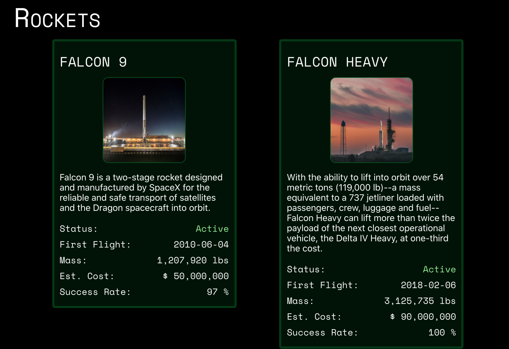

# SpaceNav

Displays data about SpaceX rocket launches in a React App. Data retrieved from the [r-spaceX/SpaceX-API](https://github.com/r-spacex/SpaceX-API). Programmed using TypeScript.

Created as final class project for ISM 4300 at the University of South Florida, Tampa.

Site is deployed to <https://spacenav.netlify.app/>.

Whenever there is new code published to the **master** branch, Netlify automatically rebuilds and deploys to <https://spacenav.netlify.app>

Project Objectives:

- Retrieve data from an external API and display with React
- Learn the React framework: React Hooks, component lifecycles, determining when to "lift state up", better understand modularity
- Learn TypeScript

This project was bootstrapped with [Create React App](https://github.com/facebook/create-react-app).

## Walkthrough

When a user first visits the website, they're initially displayed a loading spinner to show that the components are retrieving data from the SpaceX API. All the data is pulled at the root **App** component using React Hooks and passed in as props, or properties, to child components. Data from the API is in JSON format and parsed to an appropriate TypeScript interface for required data. All network logic is located inside [src/Network/index.tsx](./src/Network/index.tsx) and saved into app state using custom React Hooks in [src/Components/SpaceX/index.tsx](./src/Components/SpaceX/index.tsx).

The application automatically populates the soonest launch and inputs the time into the countdown ticker. Alternatively, countdown times can be selected by clicking on the dropdown arrow and selecting a different launch from the pre-selected launch. The countdown ticker will automatically update with the selected time. The main component that does this work is [CountdownSelector](./src/Components/Countdown/CountdownSelector.tsx).

The launch table is populated from data available on the API listing all of the upcoming launches. Some launches will contain additional details about each. An upside down arrow indicating it can be "dropped down" will be shown on the furthest left hand side of the row. Clicking on the arrow will expand to reveal the additional information. Only displayed if the launch has crew data available or mission details. Mission details are usually added in by the API within a month of the launch. The main component that does this is [LaunchTable](./src/Components/Upcoming/Upcoming.tsx).

**_NOTE:_** There is an API limitation in available launch time data. Many of the launches only have an estimate by month, so it's set to being at the end of the month. Once launch day gets closer the times change to data from officialy available sources instead of speculation and estimation by API maintainers.

Information about all of SpaceX's rockets (current, past, and upcoming) are displayed. A card is shown for each rocket that SpaceX has created, sorted by the activity status and date flights for the rockets. All content that populates the card (name/dates/costs/weight/description/img) is taken from the API. The images uses a custom react component to iterate between the different images provided by the API between a random time interval. Since all the data is pulled from the API, new rockets will automatically be added. The main component that does this is [Rockets](./src/Components/Rockets/Rockets.tsx).

There are certain things that can still probably be done to improve the application:

- There are no unit tests at all for the components, so it would be helpful to add that to ensure all the content is displayed properly, even if "bad data" is received by the API.
- Save the "state" of the application. This can help to always display data even during network interuptions, especially preventing the countdown ticker from displaying NaN. Page reloads would also be able to have the same selected countdown launch as well.

## Components

There are only 3 main components rendered within [App](./src/Components/App/App.tsx), however each of those 3 components renders child components within them based on their properties.

- [CountdownSelector](./src/Components/Countdown/CountdownSelector.tsx) - Additionally renders a [CountdownSelect](./src/components/CountdownSelector.tsx) and a [Countdown](./src/Components/Countdown/Countdown.tsx) component
- [LaunchTable](./src/Components/Upcoming/Upcoming.tsx) - Additionally renders individual Row components. If there are extended details about a mission that contains a launch crew it will render a [LaunchCrew](./src/Components/LaunchCrew/LaunchCrew.tsx) component and/or a [SpacexLaunchInfo](./src/Components/SpaceX/SpacexLaunchInfo.tsx) component.
- [Rockets](./src/Components/Rockets/Rockets.tsx) - Additionally renders a [RocketItem](./src/Components/Rockets/Rockets.tsx) component

## Installing

Requires Yarn

Run `yarn install` then `yarn start` in console to run locally in development mode.

For optimized build you have to run `yarn build`, and files will be built into the `/build` folder.

## Packages Used

I used the following packages for the creation of the application:

- [Create React App](https://github.com/facebook/create-react-app) - Initial creation of the React application
- [React Framework](https://reactjs.org/) - Rendering of the HTML
- [MaterialUI](https://material-ui.com/) - Consistent styling of container elements, countdown selection dropdown picker, launch table, and background for content
- [Electrolize (Font)](https://fonts.google.com/specimen/Electrolize) - Countdown font
- [Space Mono (Font)](https://fonts.google.com/specimen/Space+Mono) - Header font
- [Abel (Font)](https://fonts.google.com/specimen/Abel) - Table header font
- [TypeScript](https://www.typescriptlang.org/) - Type safety for JavaScript
- [ESLint](https://eslint.org/) and [Prettier](https://prettier.io/) for code styling and "linting" of the code, used the airbnb-typescript and unicorn ESLint rules

## Available Scripts

In the project directory, you can run:

### `yarn start`

Runs the app in the development mode.\
Open [http://localhost:3000](http://localhost:3000) to view it in the browser.

The page will reload if you make edits.\
You will also see any lint errors in the console.

### `yarn lint`

Runs ESLint on the source code

#### `yarn lint:fix`

Runs ESLint and automatically fixes any issues

### `yarn test`

Launches the test runner in the interactive watch mode.\
See the section about [running tests](https://facebook.github.io/create-react-app/docs/running-tests) for more information.

### `yarn build`

Builds the app for production to the `build` folder.\
It correctly bundles React in production mode and optimizes the build for the best performance.

The build is minified and the filenames include the hashes.\
Your app is ready to be deployed!

See the section about [deployment](https://facebook.github.io/create-react-app/docs/deployment) for more information.
